# TP n°4 - DeFi Staking Alyra - Unit testing

## Authors
* Jean Baptiste F.
* Etienne H.
* Anthony D. G.

## Video

https://www.brainy-club.fr/Alyra-gdwpf4dqwsh5cpmkz/

## Explanation

The unit tests concern the CrowdV.sol, StackingPool.sol, Staking.sol and TokenTest.sol files.

The tests were performed with "eth-gas-reporter" and "coverage" previously installed and configured in truffle-config.js.

```
$ truffle test
```
```
$ truffle run coverage
```

Several tests were performed by varying the values of the "optimizer" parameters in truffle-config.js.

The objective is to show the impacts of these variations.
The results are as follow: lower the number of execution cycles of the "optimizer" is, lighter the contract is and more expensive the functions to call. And on the opposite, more the number of cycles of the "optimizer" is important, heavier the contract is and less expensive the functions to call.

Here is a table summarizing the results of the file size in bytes and the costs in gas depending on the number of executions of the "optimizer":

| Optimizer | File Size (1) | Eth-Gas (2) |
|:---|:---:|---:|
| false | 26005 | 3358284 |
| 1 | 26005 | 1816700 |
| 10 | 26005 | 1816700 |
| 50 | 26021 | 1815620 |
| 100 | 26053 | 1822503 |
| 200 | 26053 | 1837985 |
| 500 | 26117 | 1894549 |

(1) in bytes. During Coverage tests.

(2) in gas. Deployments > Staking.

You will find below the screenshots of the different tests performed.

## Files

coverage.zip avec optimizer: { enabled: true, runs: 1 }.

## Images

### Coverage :

Coverage, __sans__ optimizer: {enabled: false}
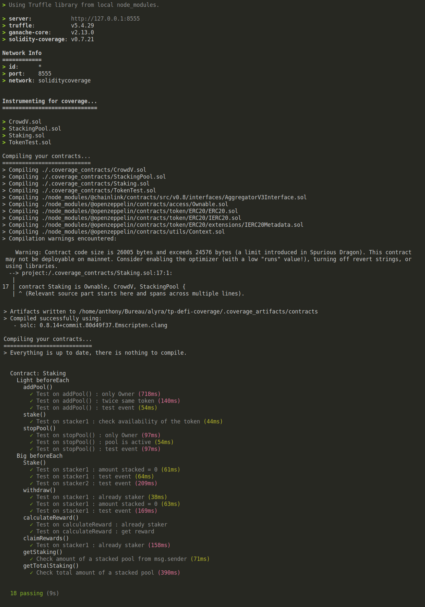

Coverage, optimizer: {enabled:true, runs:1}
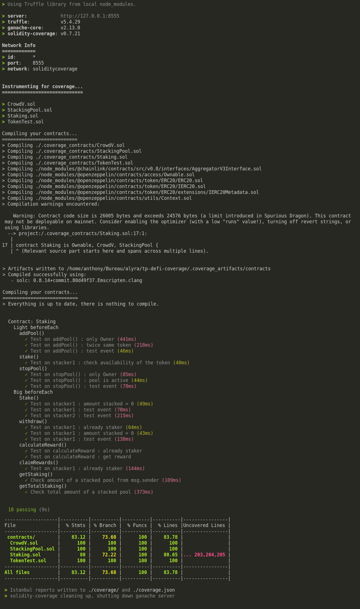

Coverage, optimizer: {enabled:true, runs:10}
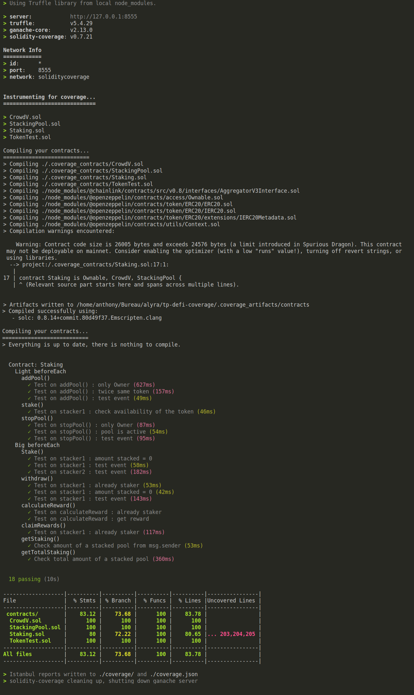

Coverage, optimizer: {enabled:true, runs:50}
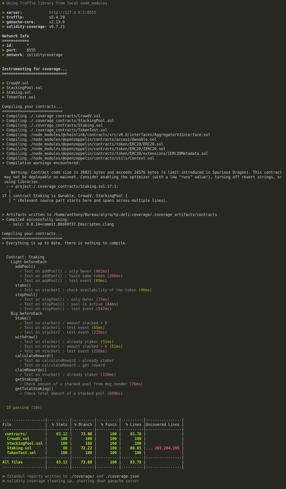

Coverage, optimizer: {enabled:true, runs:100}
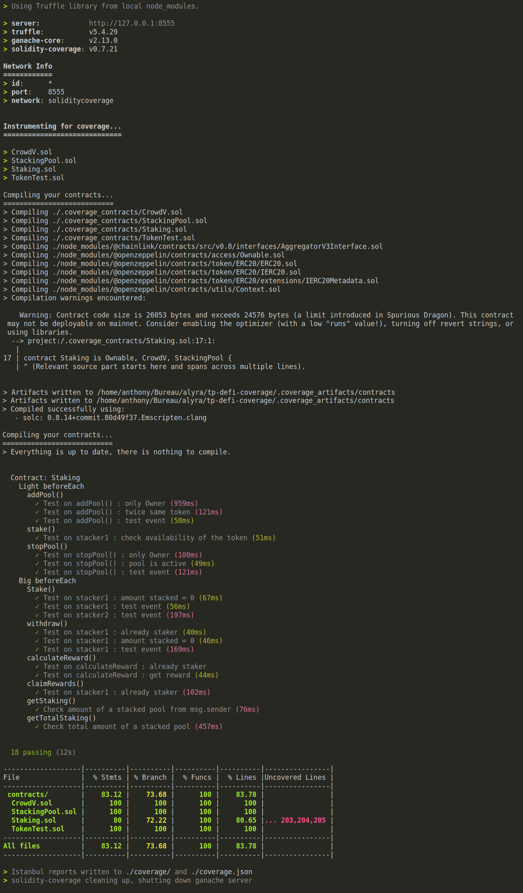

Coverage, optimizer: {enabled:true, runs:200}
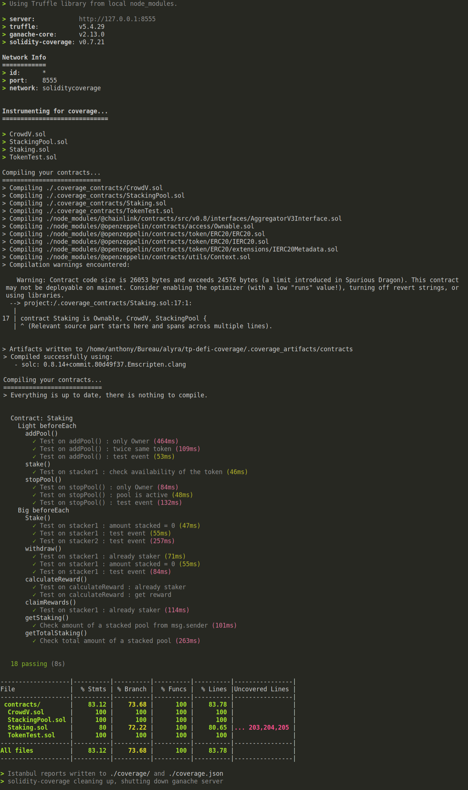

Coverage, optimizer: {enabled:true, runs:500}
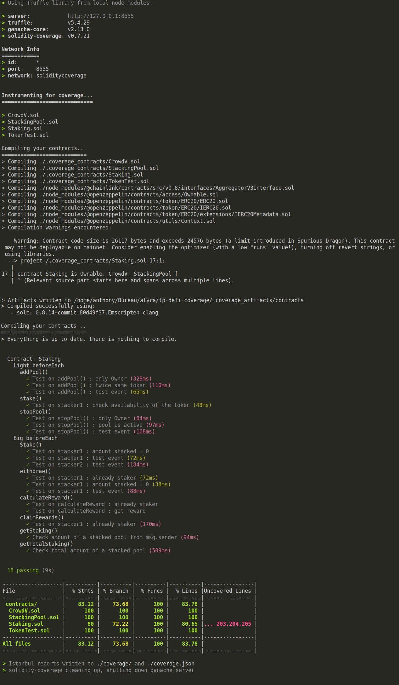

### eth-gas-reporter :

eth-gas, __sans__ optimizer: {enabled:false}
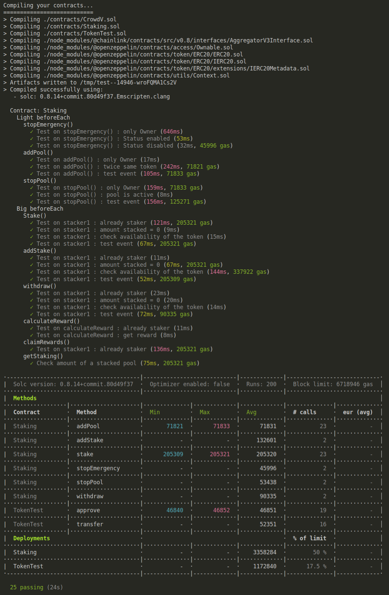

eth-gas, optimizer: {enabled:true, runs:1}
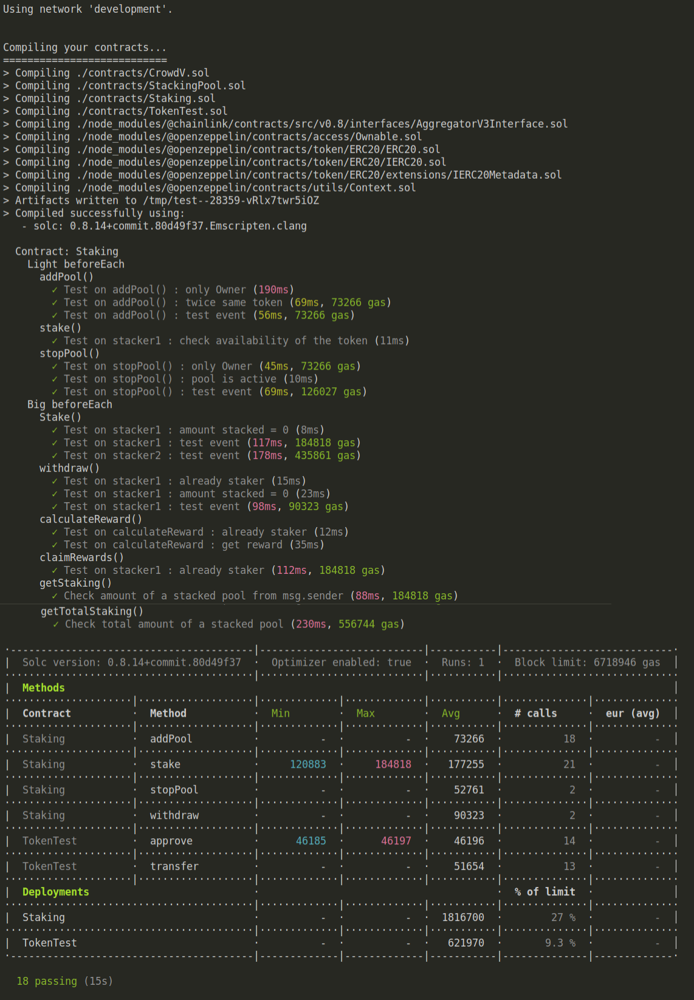

eth-gas, optimizer: {enabled:true, runs:10}
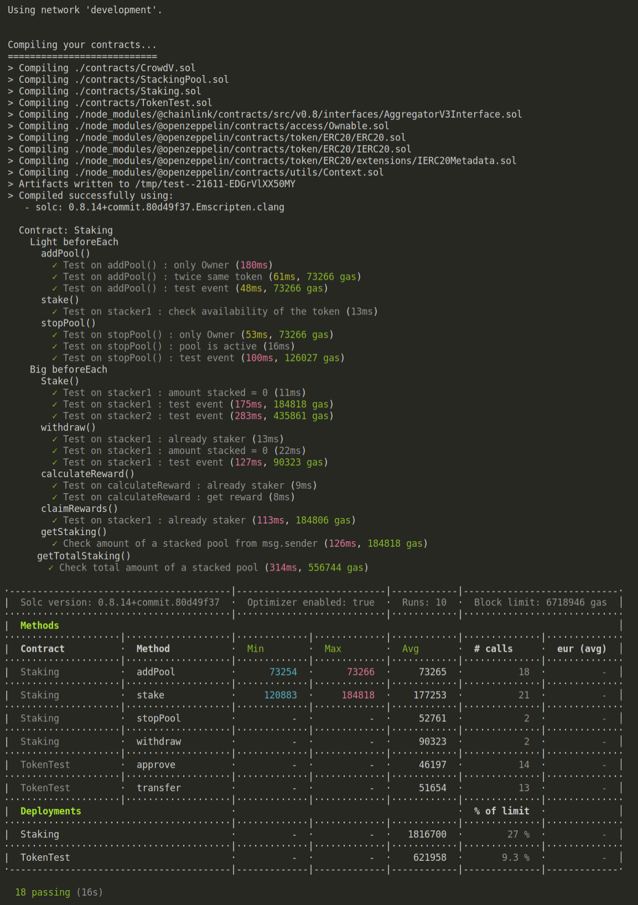

eth-gas, optimizer: {enabled:true, runs:50}
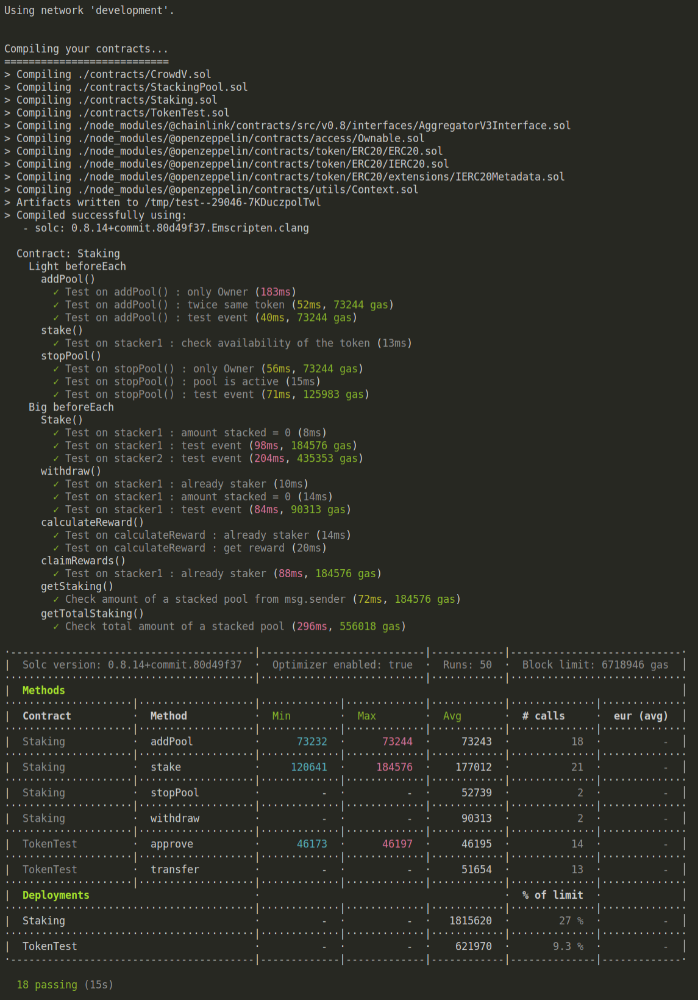

eth-gas, optimizer: {enabled:true, runs:100}
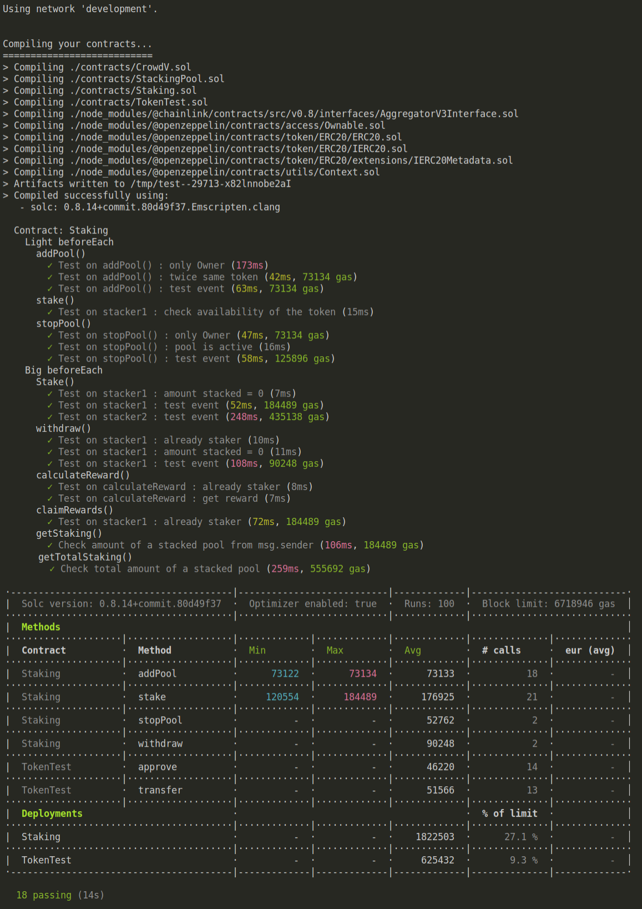

eth-gas, optimizer: {enabled:true, runs:200}
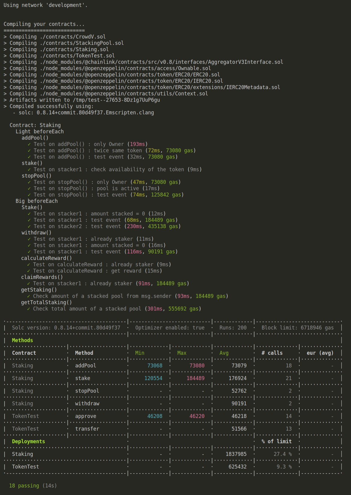

eth-gas, optimizer: {enabled:true, runs:500}
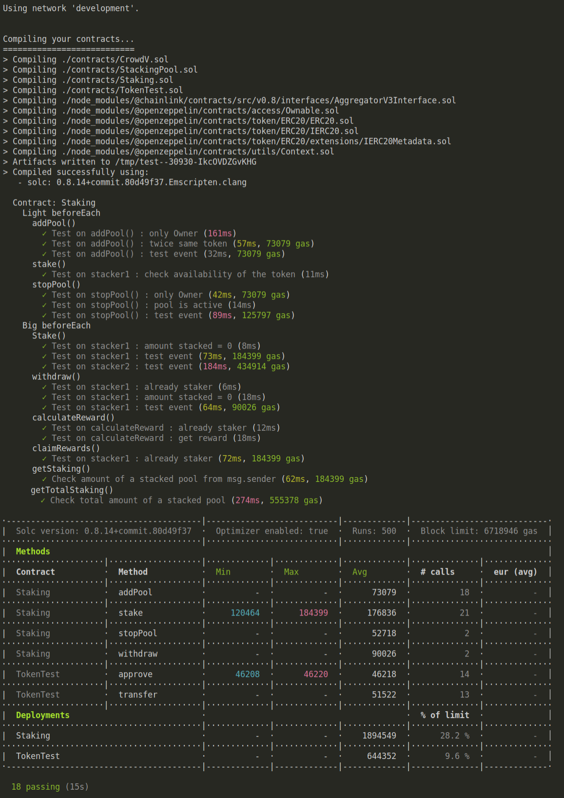
